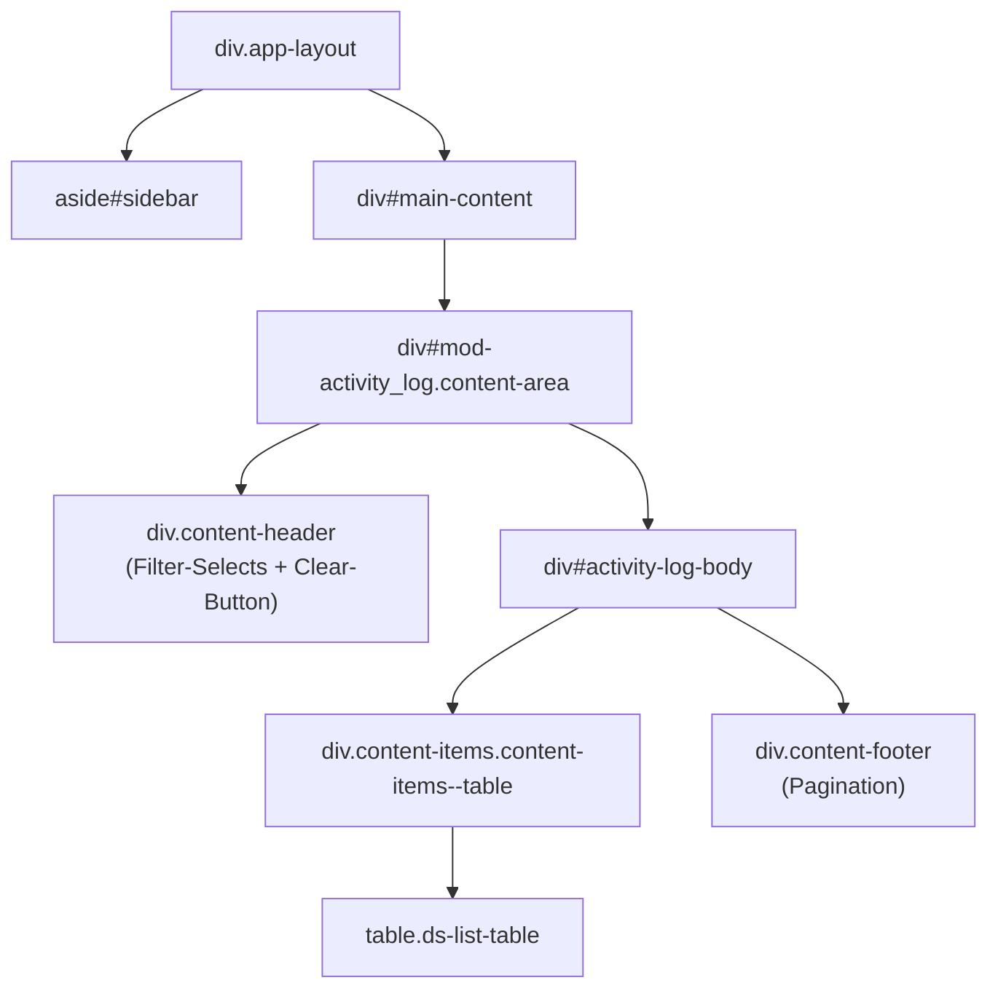
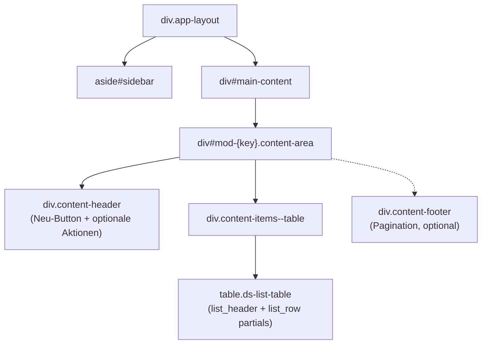

### activity_log IST

```mermaid
flowchart TD
    layout["div.app-layout"]
    sidebar["aside#sidebar"]
    main["div#main-content"]
    c_area["div#mod-activity_log.content-area"]
    c_header["div.content-header<br>(Filter-Selects + Clear-Button)"]
    body["div#activity-log-body"]
    c_items["div.content-items.content-items--table"]
    table["table.ds-list-table"]
    c_footer["div.content-footer<br>(Pagination)"]

    layout --> sidebar
    layout --> main
    main --> c_area
    c_area --> c_header
    c_area --> body
    body --> c_items
    c_items --> table
    body --> c_footer
```

### activity_log SOLL 

```mermaid
flowchart TD
    layout["div.app-layout"]
    sidebar["aside#sidebar"]
    main["div#main-content"]
    c_area["div#mod-{key}.content-area"]
    c_header["div.content-header<br>(Neu-Button + optionale Aktionen)"]
    c_items["div.content-items--table"]
    table["table.ds-list-table<br>(list_header + list_row partials)"]
    c_footer["div.content-footer<br>(Pagination, optional)"]

    layout --> sidebar
    layout --> main
    main --> c_area
    c_area --> c_header
    c_area --> c_items
    c_items --> table
    c_area -.-> c_footer
```