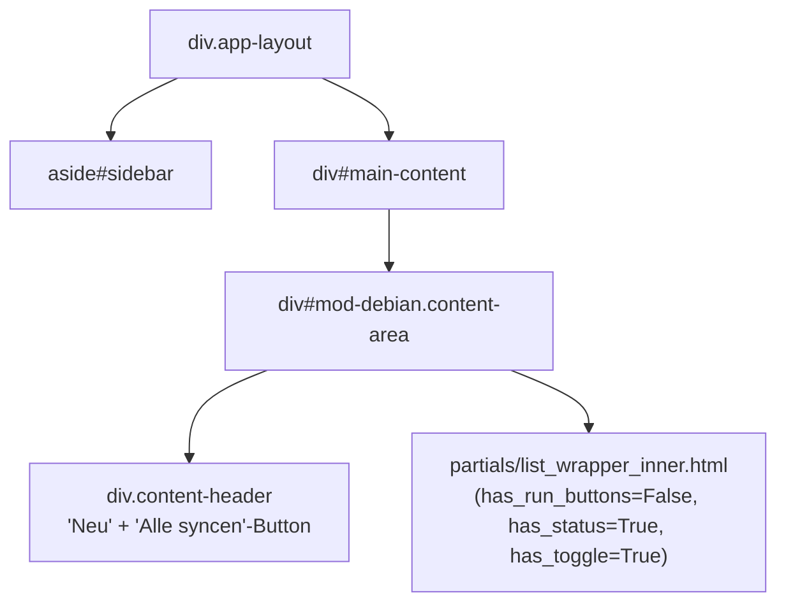

# DOM-Struktur – Modul Debian (mirror)

## 1 · Haupt-Layout



> Standard-`make_crud_router` (create/edit/delete/toggle) aus `astrapi_core`.
> Run-Aktionen sind **eigene Routen** – kein generischer Run-Router.
> Kein OOB-Polling (Sync-Status wird nach dem Sync im Store gespeichert).

---

## 2 · Card-Actions (aus `modul.yaml`)

Eigene Actions-Definition mit explizitem `hx_post/hx_get` statt `type: run`:

| Aktion | Icon | Ziel |
|---|---|---|
| Sync | refresh | `POST /ui/debian/{item}/sync` → `#{container_id} outerHTML` |
| Validieren | shield | `GET /ui/debian/{item}/validate` → `body beforeend` |
| .sources | info | `GET /ui/debian/{item}/sources-list` → `body beforeend` |
| Log | file-text | `GET /ui/debian/{item}/log` → `body beforeend` |

> Abweichung: `sync` verwendet `hx-swap="outerHTML"` statt `innerHTML` auf `#{container_id}`.

---

## 3 · Modal-Flows

```mermaid
flowchart TD
    sync_btn["Sync-Button"]
    sync_result["Aktualisierte content.html\n(kein Modal, direkte Listen-Aktualisierung)"]

    validate_btn["Validieren-Button"]
    validate_modal["modals/validate.html\n← InRelease-Check + Dateigrößen"]

    sources_btn[".sources-Button"]
    sources_modal["modals/sources_list.html\n← apt sources.list Snippet + GPG"]

    log_btn["Log-Button"]
    log_modal["modals/log.html\n← letzter Sync-Status + Issues"]

    sync_btn -->|POST /ui/debian/{id}/sync| sync_result
    validate_btn -->|GET /ui/debian/{id}/validate| validate_modal
    sources_btn -->|GET /ui/debian/{id}/sources-list| sources_modal
    log_btn -->|GET /ui/debian/{id}/log| log_modal
```

### Sync-Aktion

Kein Modal – startet `sync_repo_async()` und rendert direkt `content.html` mit Status `syncing`.
Liefert die vollständige aktualisierte Liste zurück (`hx-swap="outerHTML"` auf Container).

### Validierungs-Modal (`modals/validate.html`)

Führt `engine.validate_repo()` **synchron** aus (blockierend, schnell).
Zeigt: Gesamtstatus (OK/Fehler), Anzahl geprüfter Suites, Issue-Liste mit Farb-Codierung
(Fehlend = rot, Größenabweichung = gelb).

### Sources-List-Modal (`modals/sources_list.html`)

Generiert `apt`-`deb`-Snippet für `/etc/apt/sources.list.d/{id}.sources`.
Optional: GPG-Key-Installationsbefehl wenn `data.gpg_key` gesetzt.
Copy-Button via `navigator.clipboard.writeText()`.

### Log-Modal (`modals/log.html`)

Statisch – zeigt gespeicherten `last_status` + `last_sync_issues` aus dem Store.
Kein Polling, keine Live-Ausgabe.

### Alle Repos syncen (Page-Header)

`POST /ui/debian/sync-all` → rendert `debian/content.html` mit `sync_running=True`.
Startet `sync_all_async()` im Hintergrund.

---

## 4 · HTMX-Ziele und Swap-Strategien

| Aktion | hx-target | hx-swap |
|---|---|---|
| Content laden | `#main-content` | `innerHTML` |
| Neu / Bearbeiten (Modal) | `body` | `beforeend` |
| CRUD speichern | `#{container_id}` | `innerHTML` |
| Sync (Einzeln) | `#{container_id}` | `outerHTML` |
| Alle syncen | `#{container_id}` | `innerHTML` |
| Validieren | `body` | `beforeend` |
| sources.list | `body` | `beforeend` |
| Log | `body` | `beforeend` |

---

## 5 · Routen-Übersicht

### UI-Routen (`/ui/debian/…`)

| Methode | Pfad | Template |
|---|---|---|
| GET | `/ui/debian/content` | `content.html` (via `make_crud_router`) |
| GET/POST | CRUD-Routen | via `make_crud_router` |
| POST | `/ui/debian/{id}/sync` | `content.html` |
| POST | `/ui/debian/sync-all` | `debian/content.html` |
| GET | `/ui/debian/{id}/sources-list` | `debian/modals/sources_list.html` |
| GET | `/ui/debian/{id}/validate` | `debian/modals/validate.html` |
| GET | `/ui/debian/{id}/log` | `debian/modals/log.html` |

### API-Routen (`/api/debian/…`)

| Methode | Pfad | Funktion |
|---|---|---|
| POST | `/api/debian/sync-all` | Alle Repos syncen (async) |
| POST | `/api/debian/{id}/sync` | Einzelnes Repo syncen (async) |
| GET | `/api/debian/{id}/validate` | Validierungsergebnis als JSON |
| GET | `/api/debian/{id}/sources-list` | `deb`-Snippet als PlainText |
| GET | `/api/debian/refrapt-config` | Vollständige refrapt.conf als PlainText |

---

## 6 · Datenspeicherung

`YamlStorage("debian")` – SQLite-Tabelle `debian`.

### Datenmodell

| Feld | Typ | Inhalt |
|---|---|---|
| `id` | str (Key) | z.B. `debian-bookworm` |
| `label` | text | Anzeigename |
| `provider_group` | text | Anbieter (Debian, Proxmox, …) |
| `url` | text | Repository-URL |
| `repo_type` | select | `deb` / `deb-src` |
| `suites` | list | z.B. `["bookworm", "bookworm-updates"]` |
| `components` | list | z.B. `["main", "contrib", "non-free"]` |
| `architectures` | list | z.B. `["amd64", "arm64"]` |
| `is_flat` | boolean | Flat-Repository (keine Suites/Components) |
| `enabled` | boolean | Aktiv/Inaktiv |
| `last_run` | str | Sync-Zeitstempel |
| `last_status` | str | `ok` / `error` / `syncing` |
| `last_sync_issues` | list | Validierungsfehler (fehlende Dateien, Größen) |

---

## 7 · Sync-Ablauf

```
1. engine.generate_refrapt_config(repos) → temporäre refrapt-*.conf
2. refrapt --conf <tempfile>  (Subprocess, Timeout 12h, stdout → Activity-Log)
3. engine.validate_repo() pro Repo – parst InRelease, prüft Dateien + Größen
4. Status + issues in Store speichern
5. Notify senden
```

---

## 8 · Serving unter `/repo/debian/`

Separater FastAPI-Router in `api/repo.py` (nicht Teil des Modul-Routers):

| URL | Antwort |
|---|---|
| `/repo/debian/` | HTML-Listing (Provider-Ebene) |
| `/repo/debian/{host}/{path}/` | HTML-Listing (Unterverzeichnis) |
| `/repo/debian/{host}/{path}/file` | `FileResponse` (direkter Download) |
