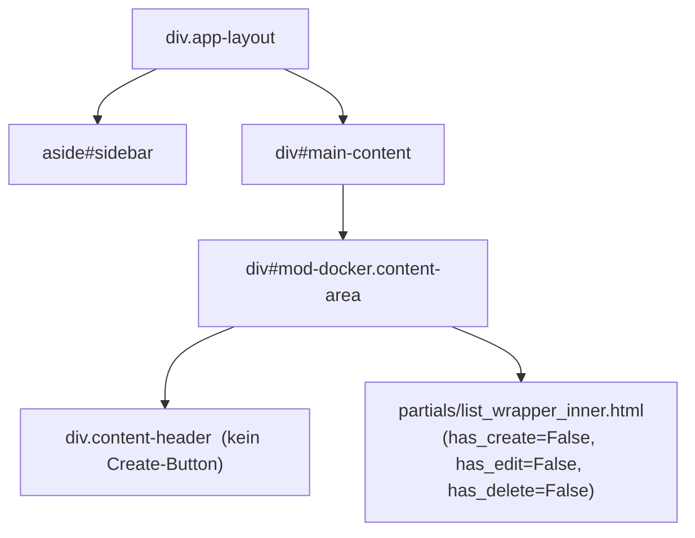

# DOM-Struktur – Modul Docker (packages)

## 1 · Haupt-Layout



> Kein CRUD – Images sind in `images.yaml` statisch definiert.
> Status-Polling via OOB (`/ui/docker/status`), identisch zum Borg-Standard.
> Kein `make_crud_router` – komplett manueller `APIRouter`.

---

## 2 · Card-Body (`partials/card_body.html`)

Zeigt Image-Konfiguration aus `IMAGES`-Dict (Tag, Dockerfile-Pfad) + Build-Status.

Card-Actions aus `modul.yaml`:

| Aktion | Icon | Aktion |
|---|---|---|
| Image bauen | play | `POST /ui/docker/{item}/build` → `#{container_id} innerHTML` |
| Build-Log | file-text | `GET /ui/docker/{item}/log` → `body beforeend` |

---

## 3 · OOB-Status-Polling

Identisch zum Borg-Standard:
- Poll-Div: `hx-get="/ui/docker/status"` `hx-trigger="every 2s"` `hx-swap="none"`
- Server rendert `partials/status_oob.html` mit OOB-TD-Fragmenten
- Deaktiviert sich automatisch wenn `running` leer ist

---

## 4 · Build-Log-Modal

```mermaid
flowchart TD
    log_btn["Build-Log-Button"]
    log_modal["modals/log.html\n#docker-log-modal"]
    log_inner["partials/log_content.html\n#docker-live-log"]

    log_btn -->|GET /ui/docker/{item}/log\nhx-target=body hx-swap=beforeend| log_modal
    log_modal --> log_inner
```

### Live-Log-Partial (`partials/log_content.html`)

- `div#docker-live-log`
- Wenn `last_status == 'building'`: `hx-get="/ui/docker/{item_id}/log-content"` `hx-trigger="every 2s"` `hx-swap="outerHTML"` → ersetzt sich selbst bis Build fertig
- `pre#docker-log-pre` mit Auto-Scroll via `scrollTop = scrollHeight`

---

## 5 · HTMX-Ziele und Swap-Strategien

| Aktion | hx-target | hx-swap |
|---|---|---|
| Content laden | `#main-content` | `innerHTML` |
| Build starten | `#{container_id}` | `innerHTML` |
| OOB-Polling (Status) | TD-Fragmente per OOB | `hx-swap-oob="true"` |
| Log-Modal öffnen | `body` | `beforeend` |
| Log-Content-Polling | `#docker-live-log` (self) | `outerHTML` |

---

## 6 · Routen-Übersicht

### UI-Routen (`/ui/docker/…`)

| Methode | Pfad | Template |
|---|---|---|
| GET | `/ui/docker/content` | `content.html` |
| GET | `/ui/docker/status` | `partials/status_oob.html` |
| POST | `/ui/docker/{item_id}/build` | `partials/list_wrapper_inner.html` |
| GET | `/ui/docker/{item_id}/log` | `docker/modals/log.html` |
| GET | `/ui/docker/{item_id}/log-content` | `docker/partials/log_content.html` |

### API-Routen (`/api/docker/…`)

| Methode | Pfad | Funktion |
|---|---|---|
| POST | `/api/docker/{item_id}/build` | Build starten (async) |
| GET | `/api/docker/{item_id}/log` | `last_log` + `last_status` als JSON |

---

## 7 · Datenspeicherung

`YamlStorage("docker")` – nur Runtime-Status (kein vollständiges CRUD-Modell).

Statische Image-Definitionen aus `images.yaml`:

| Feld | Inhalt |
|---|---|
| Image-Key | z.B. `arch-builder` |
| `tag` | Docker-Tag (z.B. `ctl/arch-builder:latest`) |
| `dockerfile` | Pfad zum Dockerfile |

Gespeicherte Runtime-Felder (via `store.upsert`):

| Feld | Inhalt |
|---|---|
| `last_status` | `building` / `ok` / `error` |
| `last_built` | Timestamp |
| `last_log` | Build-Output (letzten 20.000 Zeichen) |
