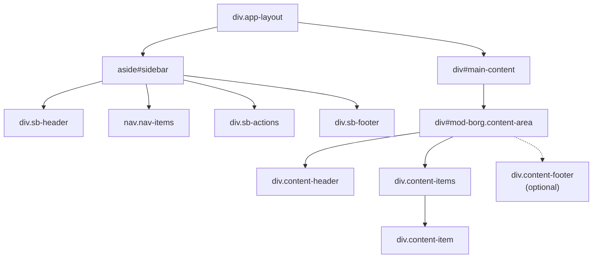

# DOM-Struktur – Modul Borg

## 1 · Haupt-Layout

```mermaid
flowchart TD
    layout["div.app-layout"]
    sidebar["aside#sidebar"]
    main["div#main-content"]
    
    s_header["div.sb-header"]
    s_nav["nav.nav-items"]
    s_actions["div.sb-actions"]
    s_footer["div.sb-footer"]

    c_area["div#mod-borg.content-area"]
    c_header["div.content-header"]
    c_items["div.content-items"]
    c_item["div.content-item"]
    c_footer["div.content-footer<br>(optional)"]

    layout --> sidebar
    layout --> main
    main --> c_area

    sidebar --> s_header

    sidebar --> s_nav
    sidebar --> s_actions
    sidebar --> s_footer

    c_area --> c_header

    c_area --> c_items
    c_items --> c_item
    c_area -.-> c_footer
```

