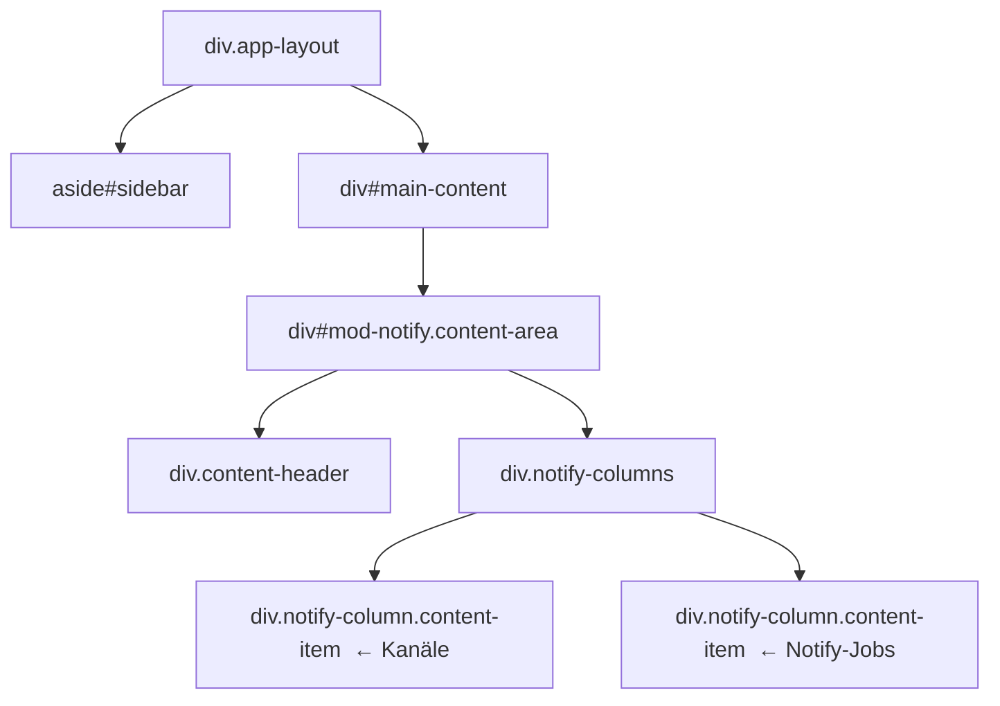
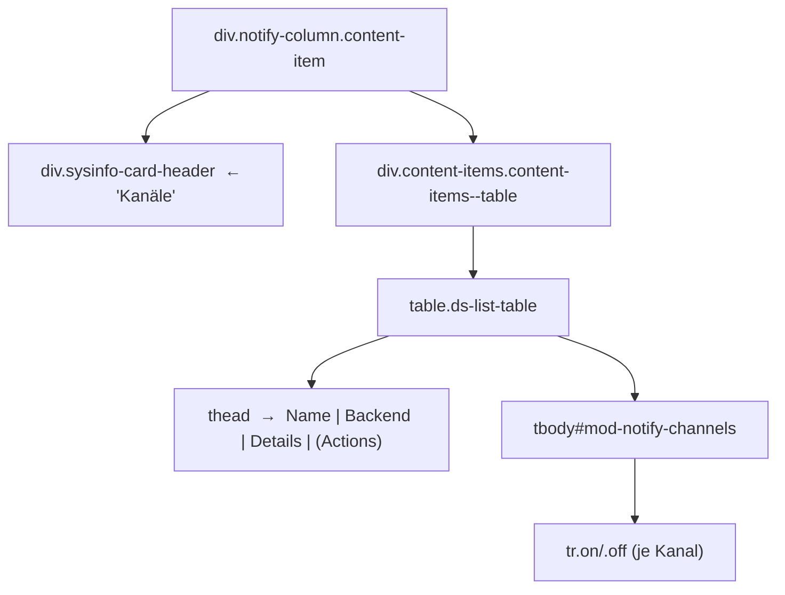
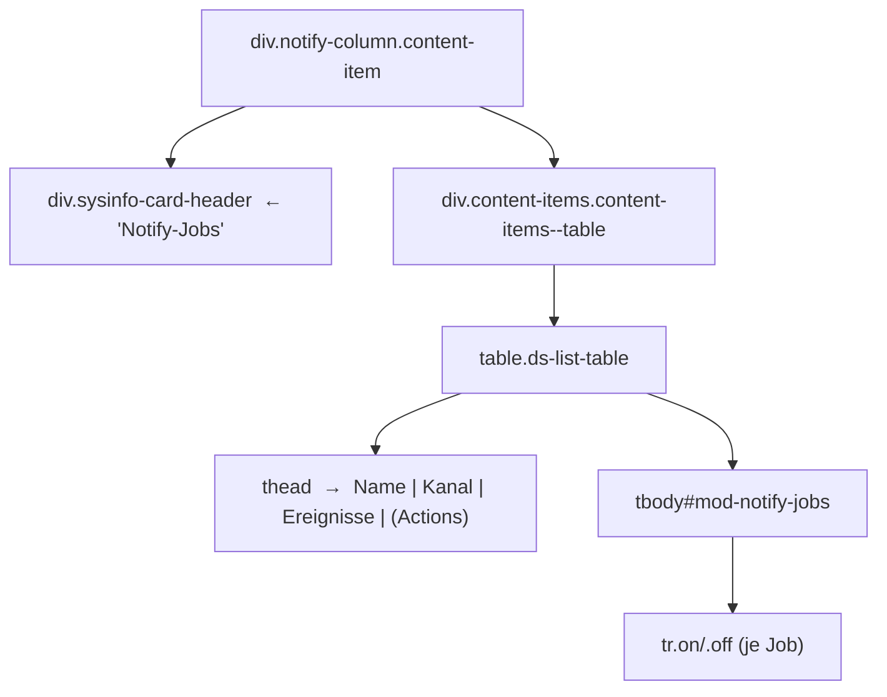
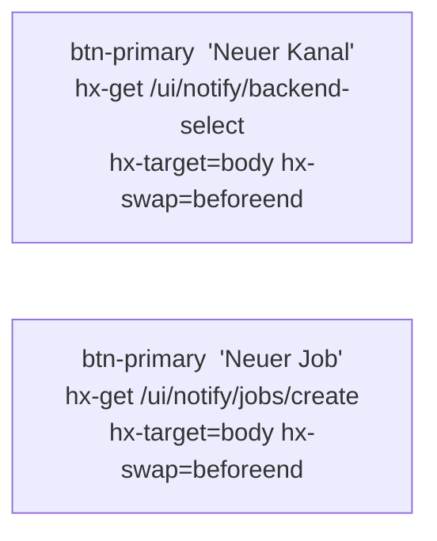
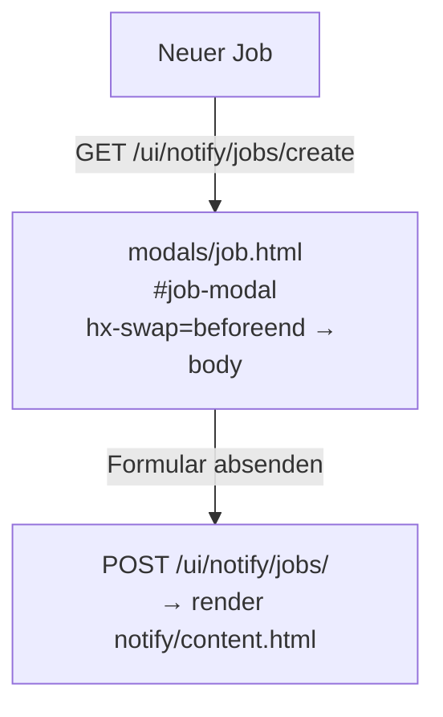

# DOM-Struktur – Modul Notify

## 1 · Haupt-Layout



> `notify/content.html` erweitert `content.html` (Block `inner`).
> Die zwei Spalten werden via `.notify-columns` nebeneinander dargestellt –
> kein generisches `list_wrapper_inner.html`, kein Status-Polling.

---

## 2 · Kanal-Spalte



### Zeilen-Spalten (je Kanal)

| Spalte | Inhalt |
|---|---|
| Name | `ch.label` oder `ch_id` |
| Backend | `span.notify-type-badge` – `ntfy` / `email` / custom |
| Details | ntfy: Server-URL + Thema · E-Mail: `mail_from` / `mail_to` |
| Actions | Ctx-Menu: Test-Senden, Bearbeiten, Löschen |

---

## 3 · Notify-Job-Spalte



### Zeilen-Spalten (je Job)

| Spalte | Inhalt |
|---|---|
| Name | `job.label` oder `job_id` |
| Kanal | `span.notify-type-badge` → Kanalname; `notify-type-badge--err` wenn Kanal fehlt |
| Ereignisse | Kommagetrennte Event-Labels (`Fehler`, `Warnung`, `Erfolg`, `Info`) |
| Actions | Ctx-Menu: Test-Senden, Bearbeiten, Löschen |

---

## 4 · Page-Header-Aktionen



---

## 5 · Modal-Flows

### 5a · Neuer Kanal (2-stufig)

```mermaid
flowchart TD
    btn["Neuer Kanal"]
    bk_sel["modals/backend_select.html\n#backend-select-modal\nhx-swap=beforeend → body"]
    ch_form["modals/channel.html\n#channel-modal\nhx-swap=beforeend → body"]
    save_new["POST /ui/notify/\n→ render notify/content.html\nhx-target=#main-content hx-swap=innerHTML"]

    btn -->|GET /ui/notify/backend-select| bk_sel
    bk_sel -->|Klick auf Backend-Karte\nGET /ui/notify/create/{backend}| ch_form
    ch_form -->|Formular absenden| save_new
```

### 5b · Kanal bearbeiten

```mermaid
flowchart TD
    edit_btn["Ctx-Menu → Bearbeiten"]
    ch_form["modals/channel.html\n#channel-modal  (Edit-Modus)\nhx-swap=beforeend → body"]
    save_edit["POST /ui/notify/{channel_id}/update\n→ render notify/content.html"]

    edit_btn -->|GET /ui/notify/{channel_id}/edit| ch_form
    ch_form -->|Formular absenden| save_edit
```

### 5c · Kanal löschen / Toggle

```mermaid
flowchart TD
    del_btn["Ctx-Menu → Löschen"]
    confirm["partials/confirm_modal.html\nhx-swap=beforeend → body"]
    del_api["DELETE /api/notify/{channel_id}\n→ reload_url /ui/notify/content\nhx-target=#mod-notify hx-swap=innerHTML"]

    del_btn -->|GET /ui/notify/{channel_id}/delete| confirm
    confirm -->|Bestätigen| del_api
```

Toggle läuft analog: `PATCH /api/notify/{channel_id}/toggle`.

### 5d · Neuer / Bearbeiten Job



Bearbeiten: `GET /ui/notify/jobs/{job_id}/edit` → `POST /ui/notify/jobs/{job_id}/update`.
Löschen: `GET /ui/notify/jobs/{job_id}/delete` → Confirm-Modal → `DELETE /api/notify/jobs/{job_id}`.

---

## 6 · Test-Badge-Flow

```mermaid
flowchart LR
    test_ch["Ctx-Menu → Test  (Kanal)"]
    test_job["Ctx-Menu → Test  (Job)"]
    badge["partials/test_badge.html\n(grün OK / rot Fehler)\nhx-target=#test-result-ch-{id}\nauto-clear nach 4 s"]

    test_ch  -->|POST /ui/notify/{channel_id}/test| badge
    test_job -->|POST /ui/notify/jobs/{job_id}/test| badge
```

Das Test-Ergebnis landet in `<span id="test-result-ch-{id}">` bzw.
`<span id="test-result-job-{id}">` direkt neben dem Ctx-Menu-Button.

---

## 7 · HTMX-Ziele und Swap-Strategien

| Aktion | hx-target | hx-swap |
|---|---|---|
| Kanäle / Jobs laden (initial) | `#main-content` | `innerHTML` |
| content.html nach CRUD | `#main-content` | `innerHTML` |
| Modals öffnen | `body` | `beforeend` |
| Test-Badge | `#test-result-{ch\|job}-{id}` | `innerHTML` |
| Confirm-Modal Reload | `#mod-notify` | `innerHTML` |

> **Kein Polling** – das Notify-Modul führt keine Hintergrund-Jobs aus
> und benötigt daher keinen `poll-notify`-Div.

---

## 8 · Routen-Übersicht

### UI-Routen (`/ui/notify/…`)

| Methode | Pfad | Handler | Template |
|---|---|---|---|
| GET | `/ui/notify/content` | `content` | `notify/content.html` |
| GET | `/ui/notify/backend-select` | `backend_select_modal` | `notify/modals/backend_select.html` |
| GET | `/ui/notify/create/{backend}` | `create_modal` | `notify/modals/channel.html` |
| GET | `/ui/notify/{channel_id}/edit` | `edit_modal` | `notify/modals/channel.html` |
| GET | `/ui/notify/{channel_id}/delete` | `delete_modal` | `partials/confirm_modal.html` |
| GET | `/ui/notify/{channel_id}/toggle` | `toggle_modal` | `partials/confirm_modal.html` |
| POST | `/ui/notify/` | `create_apply` | `notify/content.html` |
| POST | `/ui/notify/{channel_id}/update` | `edit_apply` | `notify/content.html` |
| POST | `/ui/notify/{channel_id}/test` | `test_channel_view` | `notify/partials/test_badge.html` |
| GET | `/ui/notify/jobs/create` | `create_job_modal` | `notify/modals/job.html` |
| GET | `/ui/notify/jobs/{job_id}/edit` | `edit_job_modal` | `notify/modals/job.html` |
| GET | `/ui/notify/jobs/{job_id}/delete` | `delete_job_modal` | `partials/confirm_modal.html` |
| GET | `/ui/notify/jobs/{job_id}/toggle` | `toggle_job_modal` | `partials/confirm_modal.html` |
| POST | `/ui/notify/jobs/` | `create_job_apply` | `notify/content.html` |
| POST | `/ui/notify/jobs/{job_id}/update` | `edit_job_apply` | `notify/content.html` |
| POST | `/ui/notify/jobs/{job_id}/test` | `test_job_view` | `notify/partials/test_badge.html` |

### API-Routen (`/api/notify/…`)

| Methode | Pfad | Funktion |
|---|---|---|
| GET | `/api/notify/` | Kanäle auflisten |
| GET | `/api/notify/{channel_id}` | Kanal abrufen |
| POST | `/api/notify/` | Kanal erstellen |
| PUT | `/api/notify/{channel_id}` | Kanal aktualisieren |
| PATCH | `/api/notify/{channel_id}/toggle` | Kanal aktivieren/deaktivieren |
| DELETE | `/api/notify/{channel_id}` | Kanal löschen |
| GET | `/api/notify/jobs/` | Jobs auflisten |
| GET | `/api/notify/jobs/{job_id}` | Job abrufen |
| POST | `/api/notify/jobs/` | Job erstellen |
| PUT | `/api/notify/jobs/{job_id}` | Job aktualisieren |
| PATCH | `/api/notify/jobs/{job_id}/toggle` | Job aktivieren/deaktivieren |
| DELETE | `/api/notify/jobs/{job_id}` | Job löschen |
| POST | `/api/notify/{channel_id}/test` | Kanal testen |
| POST | `/api/notify/jobs/{job_id}/test` | Job testen |

---

## 9 · Datenspeicherung

| Ressource | Storage-Key | SQLite-Tabelle |
|---|---|---|
| Kanäle | `notify_channels` | `notify_channels` |
| Jobs | `notify_jobs` | `notify_jobs` |

IDs werden beim Anlegen automatisch generiert:
- Kanal: `ch-{uuid8}` (z. B. `ch-a3f7b21c`)
- Job: `job-{uuid8}` (z. B. `job-5d9e0a1f`)

---

## 10 · Kanal-Datenmodell

| Feld | Typ | Beschreibung |
|---|---|---|
| `label` | str | Anzeigename |
| `backend` | str | `ntfy` · `email` · custom |
| `enabled` | bool | Aktiv/Inaktiv |
| `ntfy_url` | str | Server-URL (ntfy) |
| `ntfy_topic` | str | Thema (ntfy) |
| `ntfy_token` | str | Auth-Token (ntfy, optional) |
| `ntfy_verify_ssl` | bool | SSL-Prüfung (ntfy) |
| `mail_smtp_host` | str | SMTP-Server (email) |
| `mail_smtp_port` | int | SMTP-Port, Standard 587 (email) |
| `mail_smtp_user` | str | Benutzername (email) |
| `mail_smtp_password` | str | Passwort (email) |
| `mail_smtp_tls` | bool | STARTTLS (email) |
| `mail_from` | str | Absenderadresse (email) |
| `mail_to` | str | Empfängeradresse (email) |
| `mail_subject_prefix` | str | Betreff-Präfix, Standard `[Notify]` (email) |

## 11 · Job-Datenmodell

| Feld | Typ | Beschreibung |
|---|---|---|
| `label` | str | Anzeigename |
| `channel_id` | str | Referenz auf Kanal-ID |
| `enabled` | bool | Aktiv/Inaktiv |
| `events` | list[str] | `error` · `warning` · `success` · `info` |
| `sources` | list[str] | Quellen-Filter (leer = alle Quellen) |
