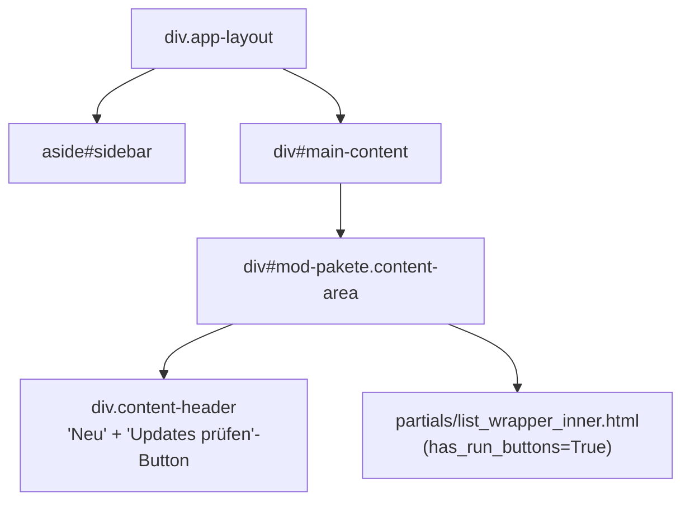

# DOM-Struktur – Modul Pakete (packages)

## 1 · Haupt-Layout



> Standard-`list_wrapper_inner.html` mit OOB-Status-Polling.
> CRUD-Routen werden **manuell** definiert (nicht via `make_crud_router` content/create/edit),
> aber Delete/Toggle kommen aus dem `_crud`-Sub-Router.

---

## 2 · Page-Header-Aktionen

| Button | Aktion |
|---|---|
| + Neu | `GET /ui/pakete/create` → `body beforeend` |
| Updates prüfen | `POST /ui/pakete/check-updates` → `#{container_id} innerHTML` |

`page_actions.html` fügt den Updates-prüfen-Button hinzu.

---

## 3 · Zeilen-Aktionen

Aus `extra_actions.html` – erscheint für alle Pakete vom Typ `!= 'custom'`:

```
<a href="https://aur.archlinux.org/packages/{item_name}" target="_blank">
  ↗ AUR-Seite
</a>
```

Standard-Aktionen aus `_crud`: Bearbeiten, Löschen, Toggle.

---

## 4 · Card-Actions (aus `modul.yaml`)

| Aktion | Typ | Ziel |
|---|---|---|
| Bauen | `run` | `POST /ui/pakete/{item}/build` → `#{container_id} innerHTML` |
| Log | `log` | `GET /ui/pakete/{item}/log` → `body beforeend` |

---

## 5 · OOB-Status-Polling

Identisch zum Borg-Standard:
- Poll-Div: `hx-get="/ui/pakete/status"` `hx-trigger="every 2s"` `hx-swap="none"`
- Status: `building` oder `pending`
- Deaktiviert sich automatisch wenn `running` leer ist

---

## 6 · Modal-Flows

```mermaid
flowchart TD
    new_btn["+ Neu  /  Bearbeiten"]
    edit_modal["modals/edit.html\n← AUR-URL, Paketname, Deps, Typ"]
    dep_preview["partials/deps_preview.html\n← Dep-Klassifizierung (neu/vorhanden/fehlt)"]
    aur_search["GET /ui/pakete/search\n← Suchfeld in Modal"]
    search_results["partials/search_results.html"]

    new_btn -->|GET /ui/pakete/create oder /{id}/edit| edit_modal
    edit_modal -->|hx-get /ui/pakete/aur-deps (on blur)| dep_preview
    edit_modal -->|hx-get /ui/pakete/search (on input)| search_results

    log_btn["Build-Log-Button"]
    log_modal["modals/log.html\n← last_log als pre"]

    log_btn -->|GET /ui/pakete/{item}/log| log_modal
```

### Edit-Modal (`modals/edit.html`)

Felder: `source_url`, `source_subdir`, `pkg_name` (nur Create), `aur_deps`, `pkg_type`, `enabled`.

Besonderheiten:
- Paketnamen-Duplikat-Prüfung: `hx-get="/ui/pakete/exists"` → `#modal-error-container`
- AUR-Dep-Vorschau: `hx-get="/ui/pakete/aur-deps"` → `#deps-preview-container`
- AUR-Suche: Live-Suche in Modal → `partials/search_results.html`

### Deps-Preview (`partials/deps_preview.html`)

Klassifiziert gefundene Abhängigkeiten aus PKGBUILD/AUR in drei Kategorien:
- `new` – müssen noch angelegt werden
- `exists` – bereits im Store
- `missing` – nicht auflösbar

---

## 7 · HTMX-Ziele und Swap-Strategien

| Aktion | hx-target | hx-swap |
|---|---|---|
| Content laden | `#main-content` | `innerHTML` |
| Neu erstellen (Apply) | `#{container_id}` | `innerHTML` |
| Bearbeiten (Apply) | `#{container_id}` | `innerHTML` |
| Updates prüfen | `#{container_id}` | `innerHTML` |
| Build starten | `#{container_id}` | `innerHTML` |
| OOB-Polling (Status) | TD-Fragmente OOB | `hx-swap-oob="true"` |
| Log-Modal | `body` | `beforeend` |
| Paketnamen-Duplikat-Check | `#modal-error-container` | `innerHTML` |
| AUR-Dep-Vorschau | `#deps-preview-container` | `innerHTML` |

---

## 8 · Routen-Übersicht

### UI-Routen (`/ui/pakete/…`)

| Methode | Pfad | Template |
|---|---|---|
| GET | `/ui/pakete/content` | `content.html` |
| GET | `/ui/pakete/status` | `partials/status_oob.html` |
| GET | `/ui/pakete/create` | `pakete/modals/edit.html` |
| POST | `/ui/pakete/` | `content.html` (Create Apply) |
| GET | `/ui/pakete/{id}/edit` | `pakete/modals/edit.html` |
| POST | `/ui/pakete/{id}/update` | `content.html` (Edit Apply) |
| GET | `/ui/pakete/search` | `pakete/partials/search_results.html` |
| GET | `/ui/pakete/aur-deps` | `pakete/partials/deps_preview.html` |
| POST | `/ui/pakete/deps` | `pakete/partials/deps_preview.html` |
| POST | `/ui/pakete/{id}/build` | `partials/list_wrapper_inner.html` |
| GET | `/ui/pakete/{id}/log` | `pakete/modals/log.html` |
| GET | `/ui/pakete/exists` | Inline-Error-Fragment |
| POST | `/ui/pakete/check-updates` | `partials/list_wrapper_inner.html` |
| DELETE/POST | CRUD (delete/toggle) | via `_crud`-Sub-Router |

### API-Routen (`/api/pakete/…`)

| Methode | Pfad | Funktion |
|---|---|---|
| POST | `/api/pakete/{id}/build` | Build starten (async) |
| GET | `/api/pakete/{id}/log` | `last_log` + `last_status` als JSON |

---

## 9 · Datenspeicherung

`YamlStorage("pakete")` – SQLite-Tabelle `pakete`.

### Datenmodell

| Feld | Typ | Inhalt |
|---|---|---|
| `id` | str (Key) | Paketname (AUR-Name oder custom) |
| `source_url` | text | AUR-Git-URL oder GitLab-URL |
| `source_subdir` | text\|None | Unterverzeichnis im Repo |
| `aur_deps` | text | Kommagetrennte AUR-Abhängigkeiten |
| `pkg_type` | select | `package` / `dependency` / `custom` |
| `enabled` | boolean | Aktiv/Inaktiv |
| `last_status` | str | `ok` / `error` / `building` / `pending` |
| `last_built` | str | Timestamp letzter Build |
| `last_log` | str | Build-Output (letzte 20.000 Zeichen) |
| `upstream_version` | str\|None | Aktuelle Version laut AUR/GitLab |
