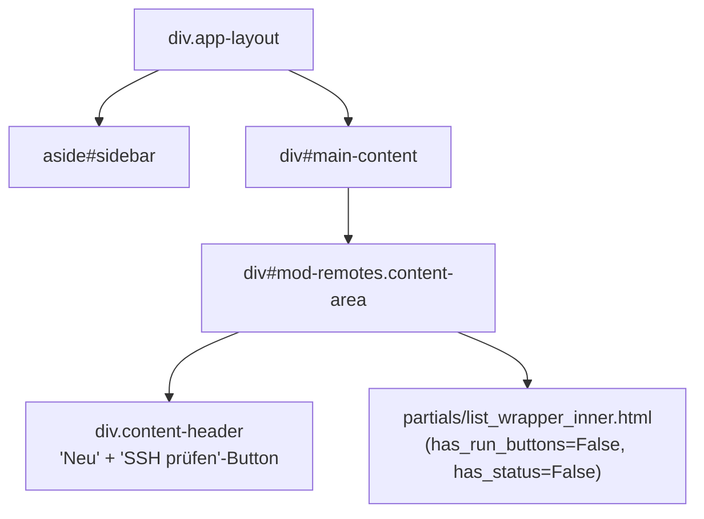

# DOM-Struktur – Modul Remotes (backup)

## 1 · Haupt-Layout



> Standard-`make_crud_router` mit `has_run_buttons=False` und `has_status=False` –
> kein Status-Badge, kein Run-Button, kein OOB-Polling.
> Besonderheit: `description_field="host"` (statt id/name).

---

## 2 · Page-Header-Aktionen

| Button | Aktion |
|---|---|
| + Neu | Standard CRUD-Create → `body beforeend` |
| SSH prüfen | `hx-get="/ui/remotes/check-ssh-modal"` → `body beforeend` |

`page_actions.html` Partial fügt nur den SSH-prüfen-Button hinzu.

---

## 3 · Zeilen-Aktionen (pro Remote)

Aus `extra_actions.html` Partial – erscheint nur wenn `item_data.mac` gesetzt ist:

```mermaid
flowchart LR
    power_btn["btn-icon 'Power'\nhx-get /ui/remotes/{item}/power-modal\nhx-target=body hx-swap=beforeend"]
    power_modal["modals/power_check.html\n← SSH-Status prüfen"]
    power_confirm["partials/power_confirm.html\n← Einschalten oder Ausschalten"]

    power_btn --> power_modal
    power_modal -->|POST /ui/remotes/{item}/power\nhx-trigger=load| power_confirm
```

Standard-Aktionen aus `make_crud_router`: Bearbeiten, Löschen, Toggle.

---

## 4 · Modal-Flows

```mermaid
flowchart TD
    ssh_btn["SSH prüfen (Page-Header)"]
    ssh_modal["modals/ssh_check_results.html\n#ssh-check-body"]
    spinner["partials/ssh_check_spinner.html"]
    ssh_table["partials/ssh_check_table.html\n← Ergebnisse aller Remotes"]

    ssh_modal --> spinner
    spinner -->|POST /ui/remotes/check-ssh-all\nhx-trigger=load| ssh_table

    power_btn["Power-Button  (Zeilen-Aktion)"]
    power_modal["modals/power_check.html\n#power-check-body-{item_id}"]
    power_confirm["partials/power_confirm.html\n← Aktion: wake / shutdown"]

    power_btn -->|GET /ui/remotes/{item}/power-modal| power_modal
    power_modal -->|POST /ui/remotes/{item}/power\nhx-trigger=load| power_confirm
```

### SSH-Check-Modal (`modals/ssh_check_results.html`)

- `#ssh-check-body` lädt initial `ssh_check_spinner.html`
- Spinner löst `hx-post="/ui/remotes/check-ssh-all"` via `hx-trigger="load"` aus
- Ergebnis (`ssh_check_table.html`) ersetzt `#ssh-check-body innerHTML`
- "Erneut prüfen"-Button ersetzt wieder durch Spinner → neues Check-Request

### Power-Check-Modal (`modals/power_check.html`)

- `#power-check-body-{item_id}` triggert `hx-post="/ui/remotes/{item}/power"` via `load`
- Server prüft SSH-Erreichbarkeit (Timeout 8s)
- Gibt `power_confirm.html` zurück: bei erreichbar → Ausschalten-Button, sonst → Einschalten-Button
- Aktionen: `POST /api/remotes/{item}/wake` (Wake-on-LAN) oder `POST /api/remotes/{item}/shutdown`

### Confirm-Modals (Standard)

Wake (`/ui/remotes/{item}/wake`) und Shutdown (`/ui/remotes/{item}/shutdown`) verwenden
das generische `partials/confirm_modal.html`.

---

## 5 · HTMX-Ziele und Swap-Strategien

| Aktion | hx-target | hx-swap |
|---|---|---|
| Content laden | `#main-content` | `innerHTML` |
| Neu / Bearbeiten | `body` | `beforeend` |
| CRUD speichern | `#mod-remotes` | `innerHTML` |
| SSH prüfen (Modal) | `body` | `beforeend` |
| SSH-Check Ergebnisse | `#ssh-check-body` | `innerHTML` |
| Power-Modal öffnen | `body` | `beforeend` |
| Power-Status prüfen | `#power-check-body-{id}` | `innerHTML` |
| Wake / Shutdown (Confirm) | `body` | `beforeend` |

---

## 6 · Routen-Übersicht

### UI-Routen (`/ui/remotes/…`)

| Methode | Pfad | Template |
|---|---|---|
| GET | `/ui/remotes/content` | `content.html` (via `make_crud_router`) |
| GET | `/ui/remotes/{item}/wake` | `partials/confirm_modal.html` |
| GET | `/ui/remotes/{item}/shutdown` | `partials/confirm_modal.html` |
| GET | `/ui/remotes/check-ssh-modal` | `remotes/modals/ssh_check_results.html` |
| GET | `/ui/remotes/check-ssh-spinner` | `remotes/partials/ssh_check_spinner.html` |
| GET | `/ui/remotes/{item}/power-modal` | `remotes/modals/power_check.html` |
| POST | `/ui/remotes/{item}/power` | `remotes/partials/power_confirm.html` |
| POST | `/ui/remotes/check-ssh-all` | `remotes/partials/ssh_check_table.html` |
| GET/POST | CRUD-Routen | via `make_crud_router` |

### API-Routen (`/api/remotes/…`)

| Methode | Pfad | Funktion |
|---|---|---|
| POST | `/api/remotes/` (create) | Neues Remote |
| PATCH | `/api/remotes/{id}/edit` | Remote aktualisieren |
| DELETE | `/api/remotes/{id}/delete` | Remote löschen |
| POST | `/api/remotes/{id}/toggle` | Aktivieren/Deaktivieren |
| POST | `/api/remotes/{id}/wake` | Wake-on-LAN senden |
| POST | `/api/remotes/{id}/shutdown` | SSH-Shutdown (`systemctl poweroff`) |
| GET | `/api/remotes/for-select` | Remote-Liste für Select-Dropdowns |

---

## 7 · Datenspeicherung

`SqliteTableStore("remotes")` – SQLite-Tabelle `remotes`.

### Datenmodell

| Feld | Typ | Inhalt |
|---|---|---|
| `id` | str (Key) | Eindeutiger Bezeichner |
| `label` | text | Anzeigename |
| `host` | text | Hostname / IP-Adresse |
| `ssh_user` | text | SSH-Benutzer (Default: `root`) |
| `ssh_port` | number | SSH-Port (Default: `22`) |
| `mac` | text\|None | MAC-Adresse für Wake-on-LAN |
| `type` | select | Typ (z.B. `server`, `desktop`, …) |
| `enabled` | boolean | Aktiv/Inaktiv |
