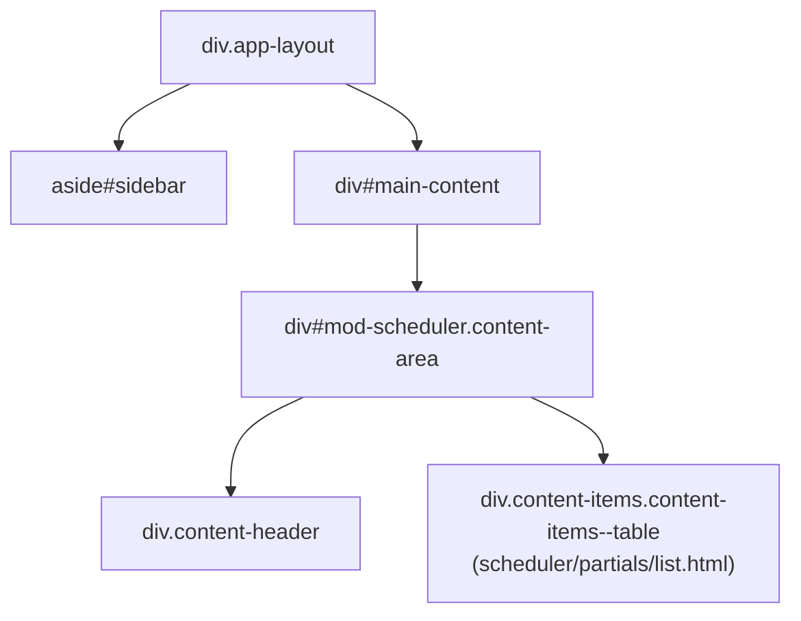
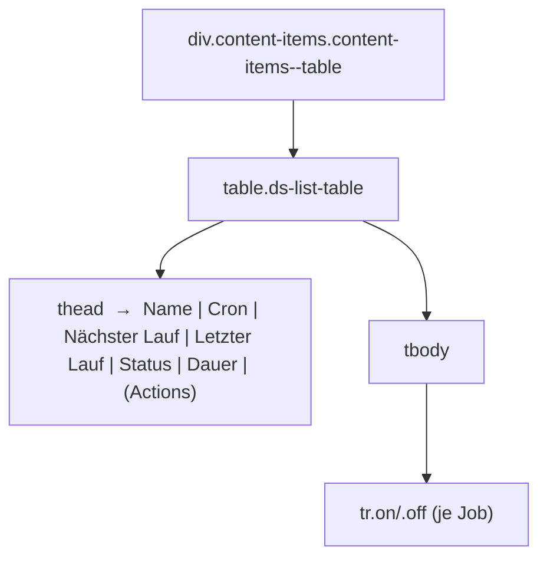
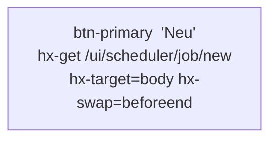
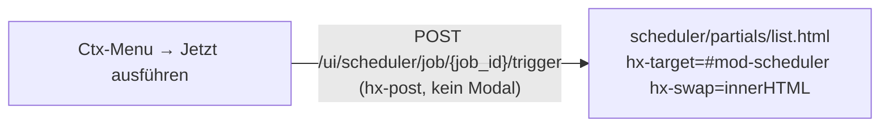

# DOM-Struktur – Modul Scheduler

## 1 · Haupt-Layout



> `scheduler/content.html` erweitert `content.html` und inkludiert im Block `inner`
> direkt `scheduler/partials/list.html` – kein generisches `list_wrapper_inner.html`,
> kein Status-Polling, kein `card_body`-Partial.

---

## 2 · Listen-Tabelle (`partials/list.html`)



### Zeilen-Spalten (je Job)

| Spalte | Inhalt | CSS-Klasse |
|---|---|---|
| Name | `job.label` | — |
| Cron | `<code>` `job.cron` | `width:130px` |
| Nächster Lauf | `job.next_run` oder `—` | `color:var(--text-3)` |
| Letzter Lauf | `job.last_run` oder `—` | `color:var(--text-3)` |
| Status | `span.status-badge.status-{last_status}` | `col-status` |
| Dauer | `job.last_duration` oder `—` | `col-hide-sm` |
| Actions | Ctx-Menu: Trigger, Toggle, Bearbeiten, Löschen | `col-actions` |

**Kein ID-Attribut auf den Zellen** – der Scheduler hat kein OOB-Polling.
Die Liste wird nur nach expliziten Aktionen (Trigger, CRUD) neu gerendert.

---

## 3 · Page-Header-Aktionen



`container_id` und `loading_id` werden als Query-Parameter mitgegeben:
`/ui/scheduler/job/new?container_id=mod-scheduler&loading_id=scheduler-loading`

---

## 4 · Modal – Neuer / Bearbeiten Job

```mermaid
flowchart TD
    btn_new["Neu"]
    btn_edit["Ctx-Menu → Bearbeiten"]
    modal["modals/edit.html\n#scheduler-job-modal\nhx-swap=beforeend → body"]

    btn_new  -->|GET /ui/scheduler/job/new| modal
    btn_edit -->|GET /ui/scheduler/job/{job_id}/edit| modal
```

### Felder im Modal (`modals/edit.html`)

| Feld | Typ | Pflicht |
|---|---|---|
| Name (`label`) | Text | ja |
| Cron-Ausdruck (`cron`) | Text + Presets + Live-Erklärung | ja |
| Schritte (`steps`) | Drag&Drop Multi-Select aus Action-Registry | nein |
| Aktiviert (`enabled`) | Toggle (via `modal_footer`) | — |

**Cron-Presets:** Täglich 02:00 / 06:00, Stündlich, Alle 15/30 Min, Mo–Fr 08:00, Wöchentlich Mo, Monatlich 1. – setzen per `cronSet()` den Input-Wert und aktualisieren `#cron-explain` via `cronUpdate()`.

**Schritte-Picker:**
- Bereits gewählte Schritte erscheinen als Drag&Drop-Karten (`div.sched-step-item`, `draggable=true`) in `#sched-selected-steps`
- Verfügbare Aktionen: Buttons `+ {label}` pro `register_action()`-Eintrag
- Reihenfolge wird als `<input type="hidden" name="steps">` in `#sched-steps-inputs` synchronisiert
- Validierungsfehler (fehlendes Label / Cron) → Inline-Error-Block, Response 422, Modal bleibt offen

### Formular-Submit

| Modus | URL | Methode | hx-target | hx-swap |
|---|---|---|---|---|
| Neu | `/ui/scheduler/job` | POST | `#main-content` | `innerHTML` |
| Edit | `/ui/scheduler/job/{job_id}/update` | POST | `#main-content` | `innerHTML` |

Bei Validierungsfehler rendert der Server das Modal erneut (Status 422) mit `error`-Nachricht.

---

## 5 · Weitere Ctx-Menu-Aktionen

### Trigger (Sofortausführung)



Die Trigger-Aktion sendet direkt `hx-post` aus einem `<form style="display:contents">` heraus und rendert die aktualisierte Liste zurück.

### Delete / Toggle

```mermaid
flowchart TD
    del_btn["Ctx-Menu → Löschen"]
    confirm["partials/confirm_modal.html\nhx-swap=beforeend → body"]
    del_api["DELETE /api/scheduler/{job_id}\n→ reload_url /ui/scheduler/content\nhx-target=#mod-scheduler hx-swap=innerHTML"]

    del_btn  -->|GET /ui/scheduler/job/{job_id}/delete| confirm
    confirm  -->|Bestätigen| del_api
```

Toggle läuft analog: `PATCH /api/scheduler/{job_id}/toggle`.

---

## 6 · HTMX-Ziele und Swap-Strategien

| Aktion | hx-target | hx-swap |
|---|---|---|
| content laden (initial + CRUD-Return) | `#main-content` | `innerHTML` |
| Trigger-Aktion | `#mod-scheduler` | `innerHTML` |
| Modals öffnen | `body` | `beforeend` |
| Confirm-Modal Reload | `#mod-scheduler` | `innerHTML` |

> **Kein Polling** – Scheduler-Jobs laufen in einem APScheduler-Background-Thread.
> Statusaktualisierungen sind nur nach expliziten Aktionen sichtbar (Seiten-Reload
> oder CRUD-Response). Kein `poll-scheduler`-Div vorhanden.

---

## 7 · Routen-Übersicht

### UI-Routen (`/ui/scheduler/…`)

| Methode | Pfad | Handler | Template |
|---|---|---|---|
| GET | `/ui/scheduler/content` | `scheduler_content` | `scheduler/content.html` |
| GET | `/ui/scheduler/job/new` | `scheduler_job_new` | `scheduler/modals/edit.html` |
| GET | `/ui/scheduler/job/{job_id}/edit` | `scheduler_job_edit` | `scheduler/modals/edit.html` |
| GET | `/ui/scheduler/job/{job_id}/delete` | `scheduler_job_delete_modal` | `partials/confirm_modal.html` |
| GET | `/ui/scheduler/job/{job_id}/toggle` | `scheduler_job_toggle_modal` | `partials/confirm_modal.html` |
| POST | `/ui/scheduler/job` | `scheduler_job_create` | `scheduler/content.html` (oder modal bei 422) |
| POST | `/ui/scheduler/job/{job_id}/update` | `scheduler_job_save` | `scheduler/content.html` (oder modal bei 422) |
| POST | `/ui/scheduler/job/{job_id}/trigger` | `scheduler_job_trigger` | `scheduler/partials/list.html` |

### API-Routen (`/api/scheduler/…`)

| Methode | Pfad | Funktion |
|---|---|---|
| GET | `/api/scheduler/` | Jobs auflisten |
| GET | `/api/scheduler/actions` | Registrierte Aktionen abrufen |
| GET | `/api/scheduler/{job_id}` | Job abrufen |
| POST | `/api/scheduler/{job_id}` | Job erstellen |
| PUT | `/api/scheduler/{job_id}` | Job aktualisieren |
| DELETE | `/api/scheduler/{job_id}` | Job löschen |
| POST | `/api/scheduler/{job_id}/trigger` | Job sofort auslösen |
| PATCH | `/api/scheduler/{job_id}/toggle` | Job aktivieren/deaktivieren |

---

## 8 · Datenspeicherung

| Ressource | Storage-Key | SQLite-Tabelle |
|---|---|---|
| Job-Definitionen | `scheduler_jobs` | `scheduler_jobs` |
| Laufzeit-Status | `scheduler_status` | `scheduler_status` |

IDs werden beim Anlegen per `uuid.uuid4().hex[:12]` generiert (z. B. `a3f7b21c9d04`).
APScheduler läuft als `BackgroundScheduler` in einem eigenen Thread mit Zeitzone `Europe/Berlin` (überschreibbar via Settings-Key `TIMEZONE`).

---

## 9 · Job-Datenmodell

| Feld | Typ | Beschreibung |
|---|---|---|
| `id` | str | UUID-Hex (12 Zeichen) |
| `label` | str | Anzeigename |
| `cron` | str | Cron-Ausdruck (APScheduler CronTrigger) |
| `enabled` | bool | Aktiv/Inaktiv |
| `steps` | list[str] | Geordnete Liste von Action-Keys |
| `notify_start` | bool | Benachrichtigung beim Job-Start |
| `notify_end` | bool | Benachrichtigung bei Job-Ende |
| `next_run` | str | Nächster geplanter Lauf (aus APScheduler) |
| `last_run` | str | Zeitstempel des letzten Laufs |
| `last_status` | str | `ok` · `error` · `warning` · `running` |
| `last_duration` | str/int | Laufzeit des letzten Laufs |

---

## 10 · Action-Registry

Module registrieren Aktionen beim App-Start einmalig:

```python
from astrapi_core.modules.scheduler.engine import register_action
register_action("hosts.check", "Hosts prüfen", check_hosts_fn)
```

`get_registered_actions()` gibt `dict[key, label]` zurück – wird im Modal für
die Schritt-Auswahl verwendet. Nicht registrierte Steps erscheinen mit ihrem Key
als Fallback-Label.
