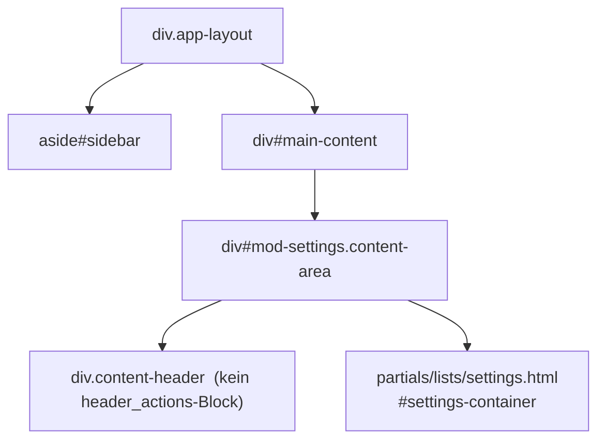
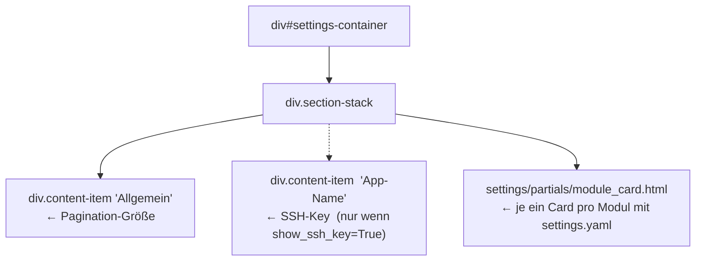
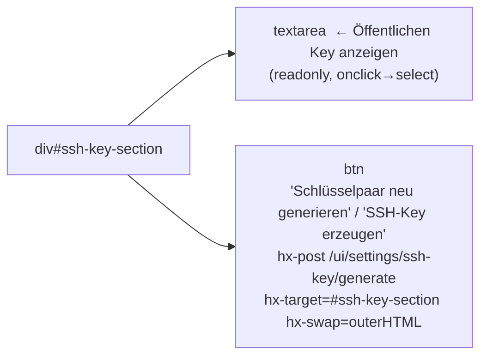

# DOM-Struktur – Modul Settings

## 1 · Haupt-Layout



> Kein CRUD, kein `list_wrapper_inner.html`. Die gesamte Seite besteht aus
> `#settings-container` (wird bei jedem Speichern vollständig neu gerendert).

---

## 2 · Settings-Container (`partials/lists/settings.html`)



### Karte: Allgemein

Formular `hx-post="/ui/settings/save/global"` → `#settings-container outerHTML`.

| Feld | Typ | Default |
|---|---|---|
| `PAGINATION_PAGE_SIZE` | number (5–200) | 15 |

### Karte: SSH-Key (optional)

Nur sichtbar wenn `show_ssh_key=True` (gesetzt in `app_cfg` der App).
Lädt `partials/ssh_key.html` per `hx-trigger="load"` → `div innerHTML`.

### Modul-Karten (`settings/partials/module_card.html`)

Eine Karte pro Modul das `settings.yaml` und `settings_button: true` hat.
Formular `hx-post="/ui/settings/save/module/{key}"` → `#settings-container outerHTML`.

Unterstützte Feld-Typen in `settings.yaml`:

| Typ | Darstellung |
|---|---|
| `text` | `<input type="text">` |
| `number` | `<input type="number">` |
| `password` | `<input type="password">` + Fernet-Verschlüsselung |
| `select` | `<select>` mit `options`-Liste |
| `checkbox` | Toggle mit Hidden-Input |
| `list` | Alpine.js-Multi-Input (hinzufügen/entfernen) |
| `section` | Trennzeile (Label-Überschrift ohne Eingabe) |

Felder können mit `cols: 2` (auf einem `section`-Eintrag) in einem 2-Spalten-Grid
gerendert werden. Einzelne Felder können `span: 2` setzen.

---

## 3 · SSH-Key-Partial (`partials/ssh_key.html`)



- `hx-confirm` wird nur gesetzt wenn bereits ein Key existiert (Sicherheitsabfrage)
- Altes Schlüsselpaar wird als `.bak` gesichert, bevor ein neues erzeugt wird

---

## 4 · HTMX-Ziele und Swap-Strategien

| Aktion | hx-target | hx-swap |
|---|---|---|
| Content laden | `#main-content` | `innerHTML` |
| Globale Einstellungen speichern | `#settings-container` | `outerHTML` |
| Modul-Einstellungen speichern | `#settings-container` | `outerHTML` |
| SSH-Key laden (initial) | `div` (Parent) | `innerHTML` |
| SSH-Key generieren | `#ssh-key-section` | `outerHTML` |

---

## 5 · Routen-Übersicht

### UI-Routen

| Methode | Pfad | Template / Antwort |
|---|---|---|
| GET | `/settings` | Shell + `settings/content.html` (initial) |
| GET | `/ui/settings/content` | `settings/content.html` |
| POST | `/ui/settings/save/global` | `settings/content.html` (voller Container) |
| POST | `/ui/settings/save/module/{key}` | `settings/content.html` (voller Container) |
| GET | `/ui/settings/ssh-key` | `settings/partials/ssh_key.html` |
| POST | `/ui/settings/ssh-key/generate` | `settings/partials/ssh_key.html` |

> `save/global` und `save/module/{key}` werden von `app.py` in
> `_register_settings_routes()` registriert (nicht von `settings/ui.py`).
> `ssh-key`-Routen sind in `settings/ui.py` definiert.

---

## 6 · Datenspeicherung

Keine eigene Tabelle – nutzt die globale Settings-Registry (`astrapi_core.ui.settings_registry`):

```
SQLite-Tabelle: settings
├── Globale Einstellungen: key → value  (z.B. PAGINATION_PAGE_SIZE)
└── Modul-Einstellungen:  module.{key}.{field} → value
```

`password`-Felder werden nicht in der Settings-Tabelle gespeichert,
sondern via Fernet-Verschlüsselung als Secrets (Schlüssel `module.{key}.{field}`).

---

## 7 · Kontext-Variablen (`_ctx()`)

| Variable | Inhalt |
|---|---|
| `settings` | `all_settings()` – Dict aller globalen Einstellungen |
| `modules` | Alle geladenen Module |
| `mod_settings` | `{key: {mod, schema, values}}` – nur Module mit `settings_schema` |
| `flash_message` | Flash-Meldung nach Speichern |
| `core_module_list` | Liste verfügbarer Core-Module (für Aktivierungs-UI) |
| `show_ssh_key` | aus `app_cfg` – steuert SSH-Key-Karte |
