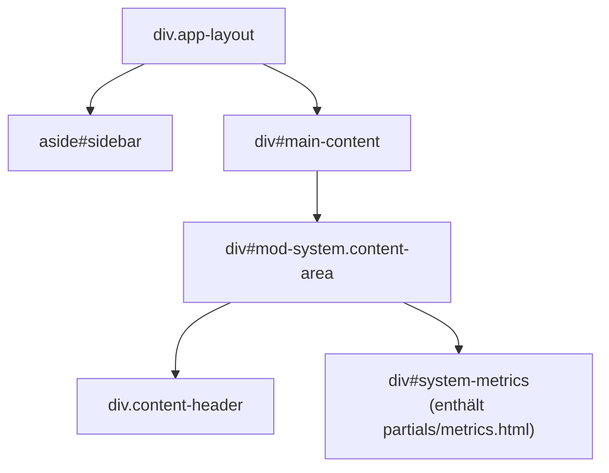
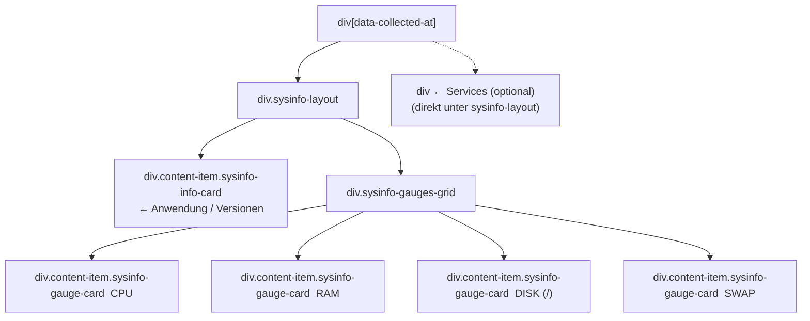
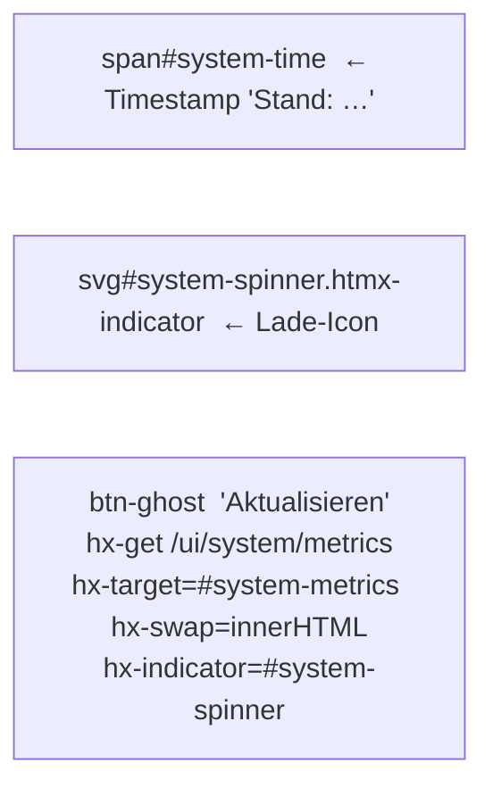
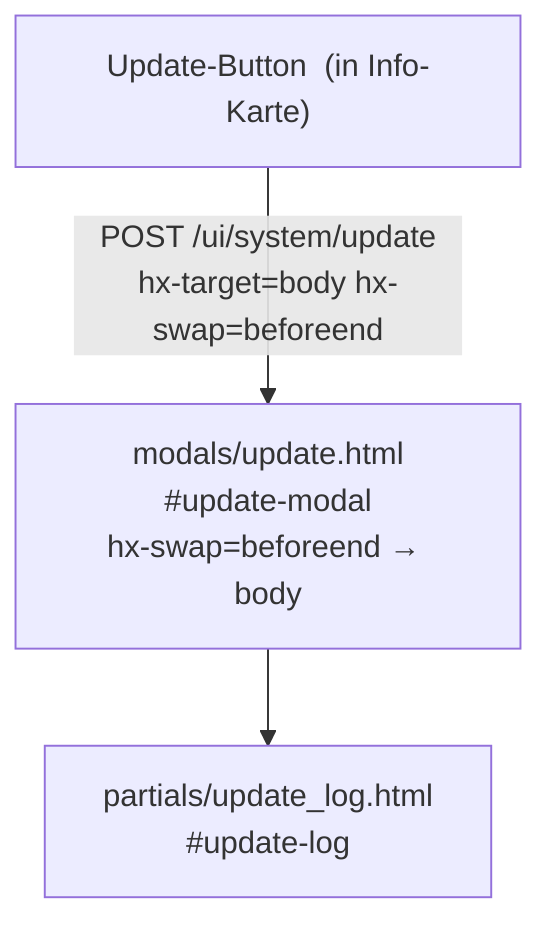
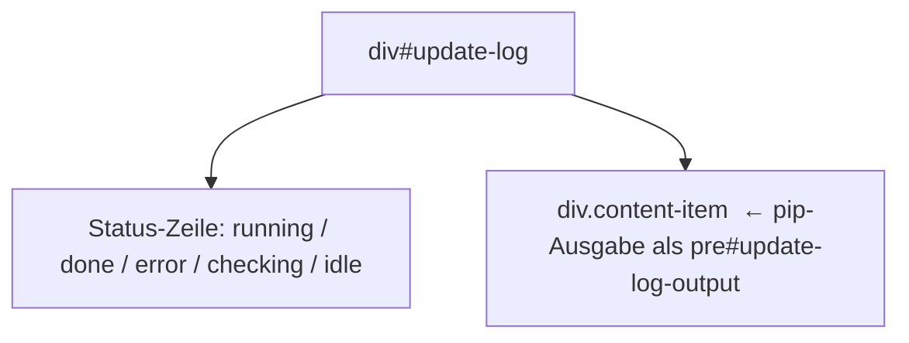

# DOM-Struktur – Modul System

## 1 · Haupt-Layout



> `system/content.html` erweitert `content.html`. Der Block `inner` besteht aus
> dem einzigen Container `#system-metrics`. Kein CRUD, kein `list_wrapper_inner.html`,
> kein Polling (außer im Update-Modal).

---

## 2 · Metrics-Partial (`partials/metrics.html`)



### Info-Karte (linke Spalte)

`table.ds-list-table` ohne Spaltenbreiten-Klassen:

| Zeile | Inhalt | Bedingung |
|---|---|---|
| Paket-Zeilen | Name · installierte Version · `→ neueste` + Update-Button | je `info.updater.packages` |
| User | `info.system.user` | immer |
| Datenbank | `info.software['Datenbank']` | falls vorhanden |
| Dependencies | restliche `info.software`-Einträge | falls vorhanden |

Der **Update-Button** (`hx-post="/ui/system/update"`) öffnet das Update-Modal via
`hx-target="body" hx-swap="beforeend"`. Er erscheint nur wenn `pkg.update_available`.

Der **Auf-Updates-prüfen-Button** (`hx-post="/ui/system/check"`) im Karten-Header
rendert `#system-metrics` direkt neu (`hx-target="#system-metrics" hx-swap="innerHTML"`).

### Gauge-Karten (rechte 2×2-Spalte)

Jede Karte besteht aus:
- `div.sysinfo-card-header` – Beschriftung (CPU / RAM / DISK / SWAP)
- `div.sysinfo-gauge-head` → `div.sysinfo-gauge-value` + Einheit `span.sysinfo-gauge-unit`
- `div.sysinfo-gauge-bar-wrap` – Fortschrittsbalken, Farbe abhängig von Schwellwert:
  - CPU: `>85 %` → rot, `>50 %` → blau, sonst grün
  - RAM: `>85 %` → rot, `>60 %` → blau, sonst grün
  - DISK: `>90 %` → rot, `>70 %` → blau, sonst grün
  - SWAP: `>70 %` → rot, sonst `var(--b-dim)`
- `div.sysinfo-gauge-sub` – Detailzeile (Kerne · Frequenz · Modell / belegt · frei · gesamt)

### Service-Liste (optional)

Wird nur gerendert wenn `info.services` nicht leer ist.
Jeder Service: `div.sysinfo-layout` → `div` (Name + Desc) + `span.status-badge` (aktiv/inaktiv).

---

## 3 · Page-Header-Aktionen



Nach dem Swap aktualisiert ein `htmx:afterSettle`-Listener den Timestamp
in `#system-time` aus dem `data-collected-at`-Attribut des neuen Partials.

---

## 4 · Update-Modal



### Update-Log-Partial (`partials/update_log.html`)



**Polling während `status == 'running'`:**
- `data-running="1"` wird gesetzt
- `hx-get="/ui/system/update-log"` `hx-trigger="every 2s"` `hx-swap="outerHTML"`
- Wenn der Server `status != 'running'` zurückgibt, fehlt `data-running` → Polling stoppt
- Schließen-Button (`✕`) ist während `running` `disabled`

---

## 5 · HTMX-Ziele und Swap-Strategien

| Aktion | hx-target | hx-swap |
|---|---|---|
| Content laden (initial + Reload) | `#main-content` | `innerHTML` |
| Aktualisieren-Button | `#system-metrics` | `innerHTML` |
| Updates prüfen | `#system-metrics` | `innerHTML` |
| Update starten | `body` | `beforeend` |
| Update-Log-Polling | `#update-log` (self) | `outerHTML` |

> **Polling nur im Update-Modal** – `#system-metrics` selbst wird nicht gepollt.
> Die Systeminfo ist ein Snapshot zum Zeitpunkt des letzten Ladens.

---

## 6 · Routen-Übersicht

### UI-Routen (`/ui/system/…`)

| Methode | Pfad | Handler | Template |
|---|---|---|---|
| GET | `/ui/system/content` | `system_content` | `system/content.html` |
| GET | `/ui/system/metrics` | `system_metrics` | `system/partials/metrics.html` |
| POST | `/ui/system/check` | `system_check` | `system/partials/metrics.html` |
| POST | `/ui/system/update` | `system_update` | `system/modals/update.html` |
| GET | `/ui/system/update-log` | `system_update_log` | `system/partials/update_log.html` |

### API-Routen (`/api/system/…`)

| Methode | Pfad | Funktion |
|---|---|---|
| GET | `/api/system/` | Vollständige Systeminfo |
| GET | `/api/system/cpu` | CPU-Daten (gecacht) |
| GET | `/api/system/ram` | RAM-Daten (gecacht) |
| GET | `/api/system/disk` | Disk-Daten (gecacht) |
| GET | `/api/system/update-status` | Updater-Status + Paketversionen |
| POST | `/api/system/check` | Update-Check starten |
| POST | `/api/system/update` | Update-Prozess starten |

---

## 7 · `collect()`-Datenmodell (`info`-Objekt)

| Schlüssel | Typ | Inhalt |
|---|---|---|
| `ok` | bool | `True` wenn psutil verfügbar |
| `error` | str\|None | Fehlermeldung falls `ok=False` |
| `collected_at` | str | Timestamp `HH:MM:SS` |
| `cpu.percent` | int | Auslastung % |
| `cpu.cores` | int | Anzahl CPU-Kerne |
| `cpu.freq` | str | Taktfrequenz (formatiert) |
| `cpu.model` | str | CPU-Modell (optional) |
| `mem.percent` | int | RAM-Auslastung % |
| `mem.used/free/total` | str | Formatierte Bytes |
| `root_disk.percent` | int | `/`-Auslastung % |
| `root_disk.used_fmt/free_fmt/total_fmt` | str | Formatierte Bytes |
| `swap.percent` | int | Swap-Auslastung % |
| `swap.used/total` | str | Formatierte Bytes |
| `system.user` | str | Laufender Unix-User |
| `software` | dict[str, str] | Python-Version + optionale Extras aus `extra_info_fn` |
| `services` | list[dict] | `[{name, desc, active, enabled, ok}]` |
| `updater` | dict\|None | `{packages: [{name, installed, latest, update_available}]}` |

---

## 8 · Erweiterung (projektspezifisch)

```python
from astrapi_core.modules.system.engine import configure

configure(
    services=["myapp", "nginx"],
    extra_info_fn=lambda: {"Version": "1.2.3", "DB": "4 MB"},
    extra_disks=["/mnt/data"],
    update_packages_fn=lambda: [...],  # [{name, pip_name, installed, latest, update_available}]
)
```

Der Updater benötigt zusätzlich:

```python
from astrapi_core.modules.system import updater as _updater
_updater.configure(app_root=Path(...))
```

Apps können `overrides/sysinfo.py` anlegen, um beide Konfigurationen beim Start einzuspielen.

---

## 9 · Updater-Status

| Status | Bedeutung |
|---|---|
| `idle` | Kein laufender Prozess |
| `checking` | Update-Check läuft (pip list --outdated) |
| `running` | pip install läuft, Ausgabe wird gestreamt |
| `done` | Update abgeschlossen, App-Restart folgt |
| `error` | Fehler aufgetreten, `state["error"]` enthält Meldung |
