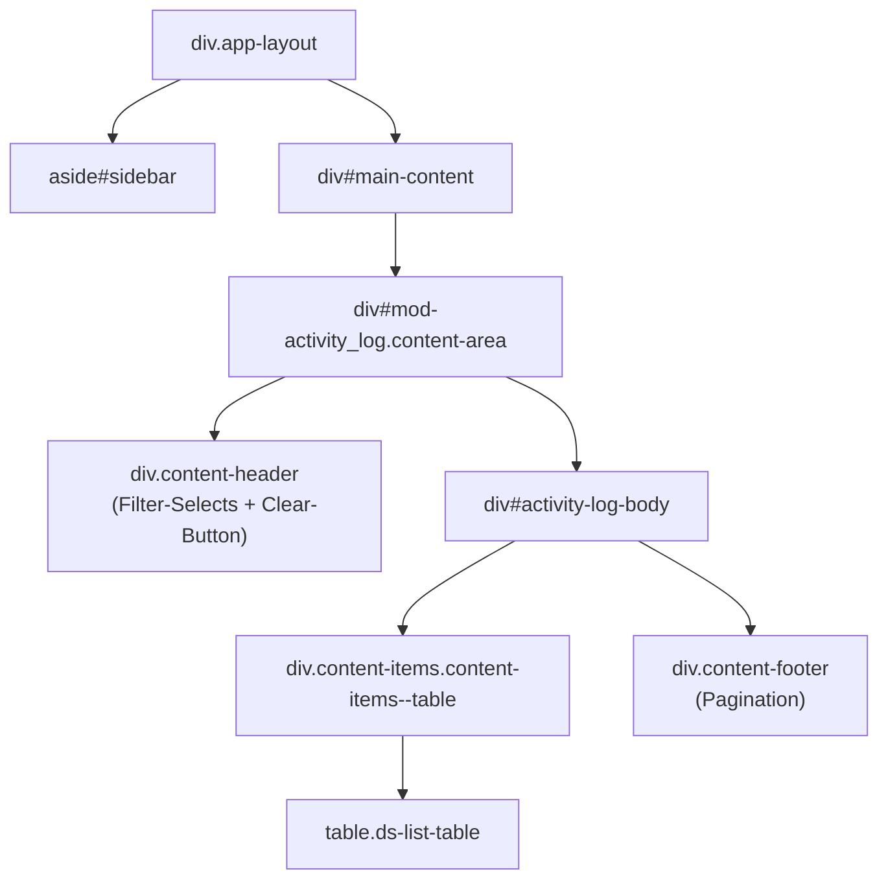
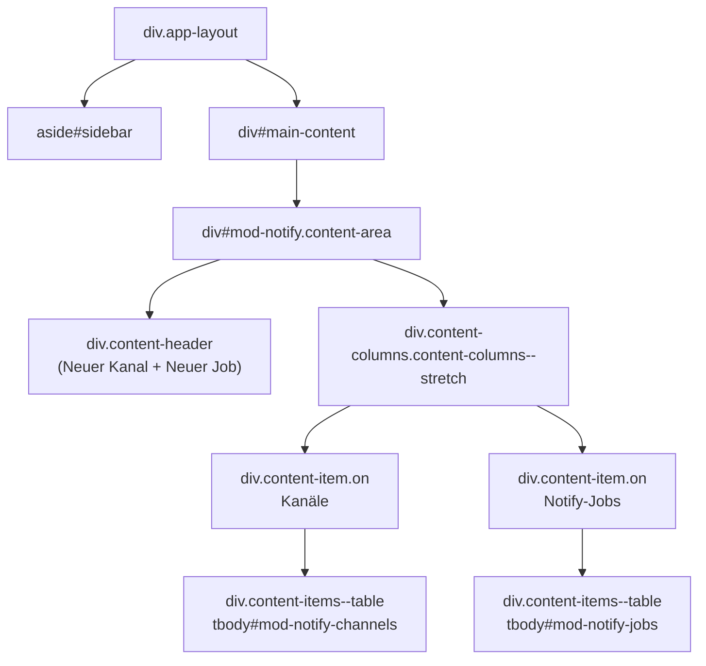
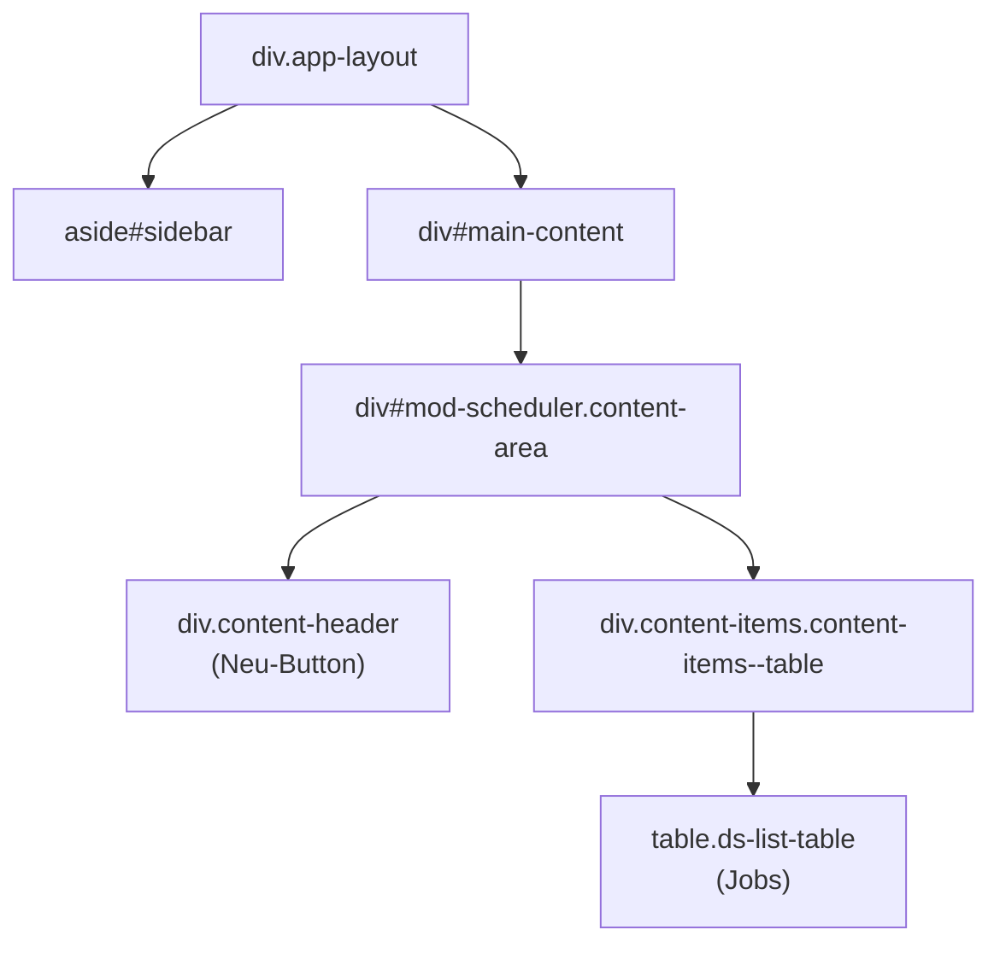
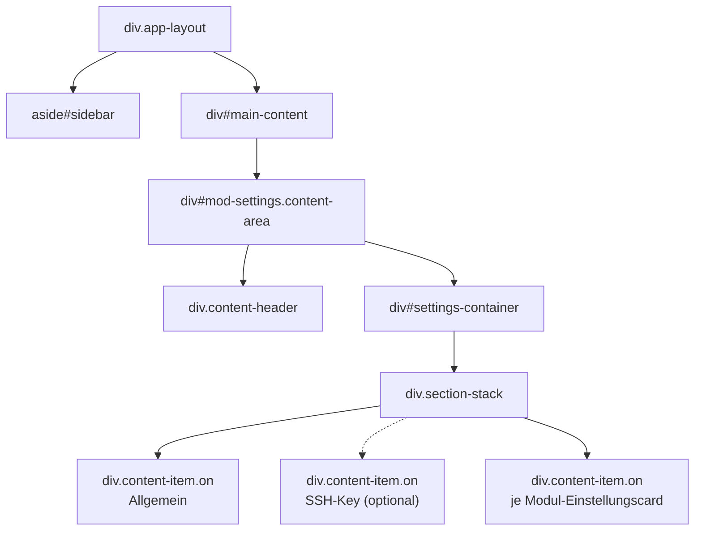
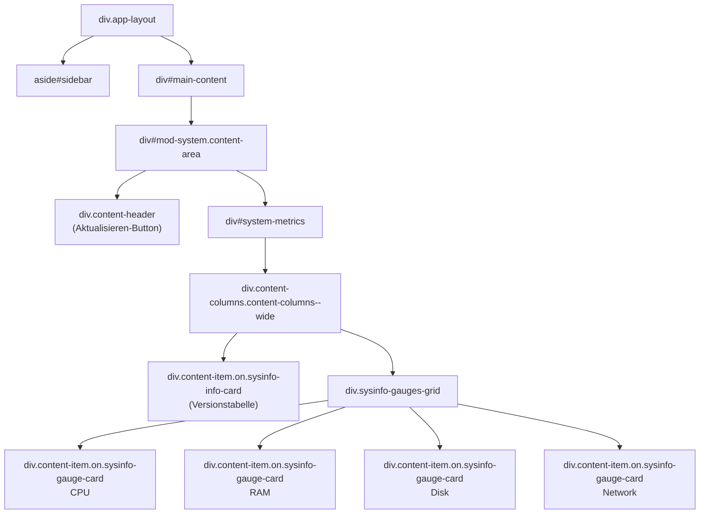
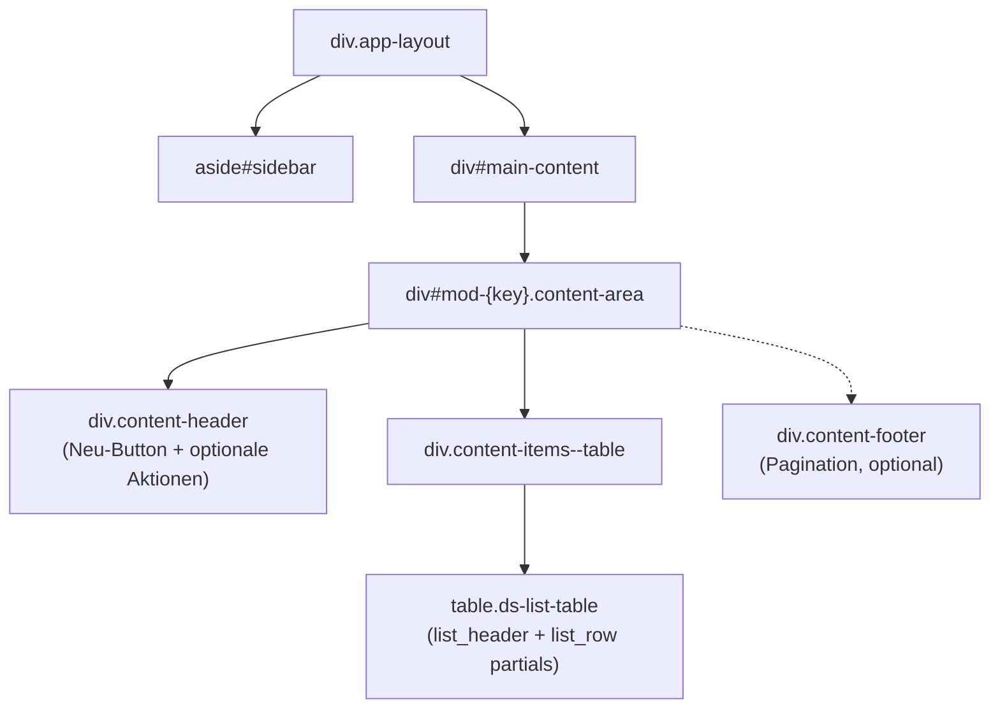
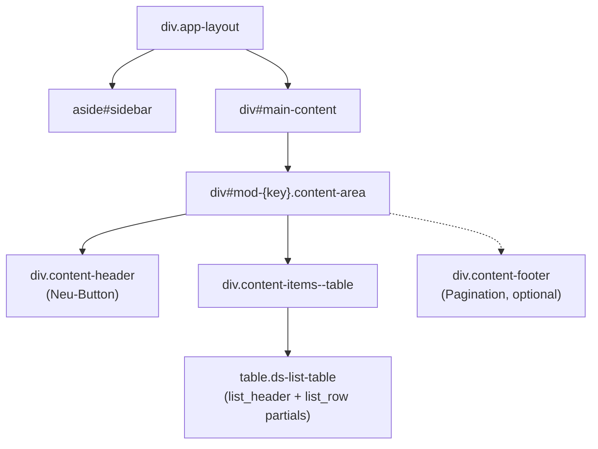
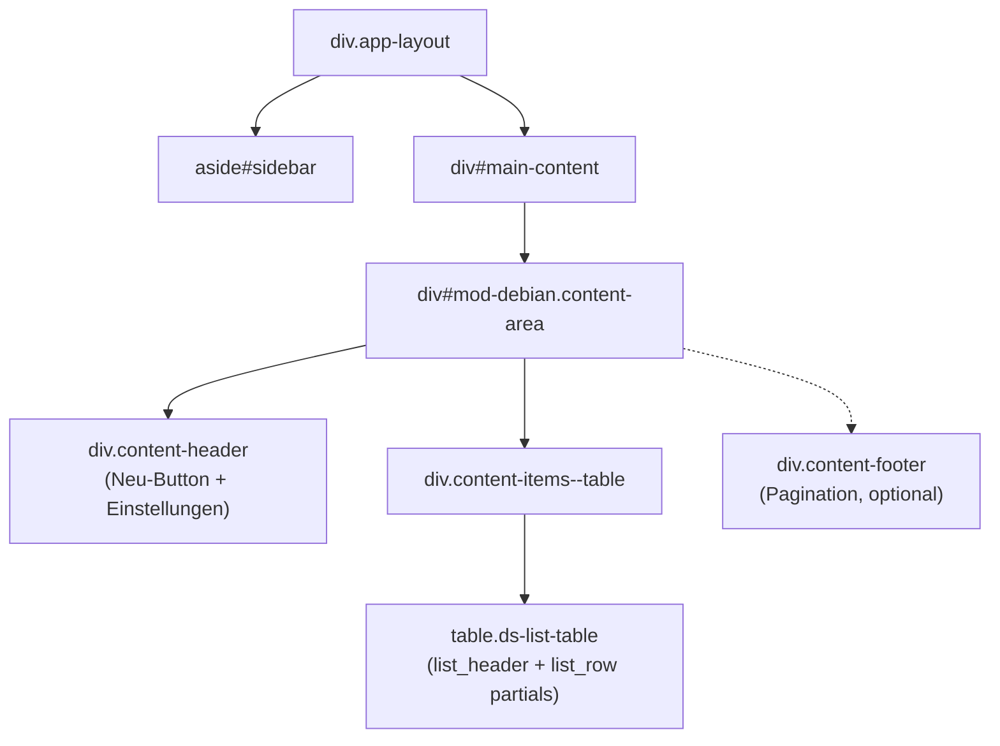

# DOM-Struktur – Haupt-Layout aller Module

## Ränder (padding / margin) – Desktop

| Selektor | padding | margin | gap |
|---|---|---|---|
| `.app-layout` | `12px` (rundum) | – | `12px` |
| `#sidebar` | – | – | – |
| `.sb-header` | `0 8px` (h: 47px) | – | – |
| `.nav-items` | `6px 8px` | – | `2px` |
| `.nav-item` | `10px 12px` | – | – |
| `.nav-divider` | – | `4px 8px` | – |
| `.sb-actions` | `4px 8px` | – | `6px` |
| `.sb-footer` | `6px 8px 10px` | – | – |
| `.sb-divider` | – | `0 8px` | – |
| `.main-content` | `0` | – | – |
| `.content-area` | `32px` (rundum) | – | – |
| `.content-header` | `12px 16px` | `0 0 24px 0` (unten) | – |
| `.content-footer` | `10px 16px` | `24px 0 0 0` (oben) | – |
| `.content-item` | `0` | – | – |
| `.card-body` | `16px` | – | `8px` |
| `.card-actions` | `12px 8px 10px` | – | `6px` |
| `.card-header` | `12px 16px 10px` | – | `8px` |
| `.card-footer` | `10px 16px` | – | – |
| `.card-run-info` | `6px 16px` | – | – |

### Mobile (`max-width: 768px`)

| Selektor | padding | margin |
|---|---|---|
| `.app-layout` | `0` | – |
| `.main-content` | `56px 16px 16px` | – |
| `.page-header` | `0 14px 0 58px` | `0 -14px 16px -14px` |

---

## Karten-Grid-Layouts (`.content-columns`)

Module die mehrere `content-item`-Karten nebeneinander anzeigen (kein Standard-`content-items`-Grid), verwenden die generischen Grid-Klassen:

| Klasse | Spalten | `align-items` | Verwendung |
|---|---|---|---|
| `.content-columns` | `1fr 1fr` | `start` | Basis: gleichbreite 2-Spalten |
| `.content-columns--stretch` | _(erbt)_ | `stretch` | gleiche Kartenhöhe – `notify` |
| `.content-columns--wide` | `minmax(0,1.3fr) minmax(0,1fr)` | _(erbt)_ | breite linke Karte – `system` |

**Responsive** (`max-width:900px`): `.content-columns`, `.content-columns--wide` → `grid-template-columns:1fr`

**Verwendung je Modul:**

| Modul | Klassen am Container |
|---|---|
| `notify` | `content-columns content-columns--stretch` |
| `system` | `content-columns content-columns--wide` |

---

## astrapi-core

### activity_log

### notify

### scheduler

### settings

### system

---

## astrapi-backup

> Alle Backup-Module (borg, rsync, proxmox_lxc, proxmox_hosts, proxmox_jobs, remotes) teilen dasselbe CRUD-Layout.

### borg / rsync / proxmox_lxc / proxmox_hosts / proxmox_jobs / remotes

---

## astrapi-packages

> docker und pakete teilen dasselbe CRUD-Layout.

### docker / pakete

---

## astrapi-mirror

### debian

